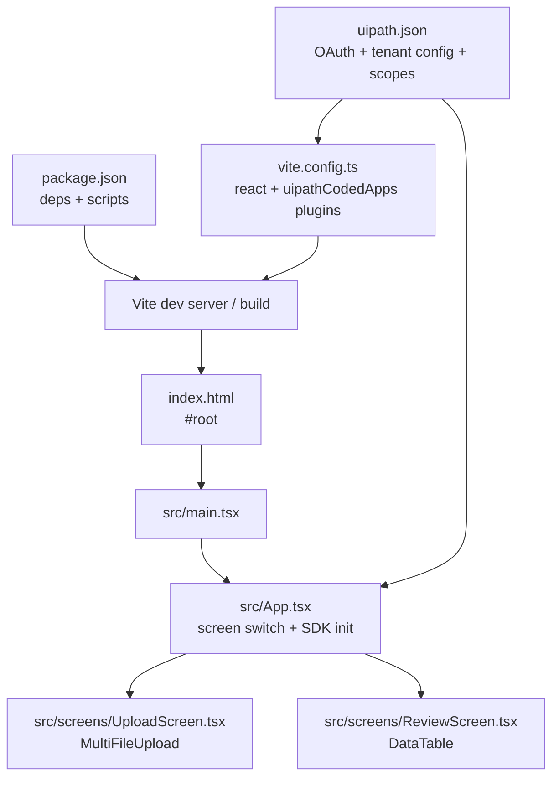

# ClaimDesk

A small internal UiPath Coded Web App (React 19 + Vite + TypeScript) for handling claim documents. Two screens:

1. **Upload** (`/`) — staff upload claim PDFs to an Orchestrator storage bucket.
2. **Review** (`/review`) — a reviewer browses and edits claims in a Data Fabric table.

Navigation is plain conditional rendering in `App.tsx` (no router).

## Widgets

| Package | Used in | Purpose |
| --- | --- | --- |
| `@uipath/ui-widgets-multi-file-upload` | Upload screen | Multi-file upload straight to a storage bucket, with success/error callbacks. |
| `@uipath/ui-widgets-datatable` | Review screen | ag-Grid table over a Data Fabric entity with sort/filter/inline-edit/add/delete. |

> The original spec also listed `@uipath/ui-widgets-pdf-viewer` and `@uipath/ui-widgets-validation-station` for a side-by-side PDF + extracted-fields review panel. `ui-widgets-pdf-viewer` is not a published package, and the Validation Station flow (which depends on Action Center `DocumentValidation` tasks) was removed. Review is the datatable only.

## File map



Runtime path: `index.html` → `src/main.tsx` → `src/App.tsx` → `UploadScreen` / `ReviewScreen`.

## Authored files

| File | Purpose |
| --- | --- |
| `src/App.tsx` | Initializes the SDK once, sets the widget theme body class, switches between the two screens. |
| `src/screens/UploadScreen.tsx` | `<MultiFileUpload>` wired to the `claim-documents` bucket. On success, shows a message and jumps to Review. |
| `src/screens/ReviewScreen.tsx` | `<DataTable>` over the `Claims` Data Fabric entity. |
| `src/main.tsx` | React mount (unchanged from the scaffold). |
| `vite.config.ts` | `react()` + `uipathCodedApps()`, `base: './'`. |
| `uipath.json` | Non-confidential OAuth config + runtime scopes. |
| `tsconfig.json` | TypeScript rules. |

`node_modules/`, `package-lock.json`, `dist/` are generated.

## Configuration you must edit

All config lives as constants at the top of the relevant screen file.

**`src/screens/UploadScreen.tsx`**

| Constant | Meaning |
| --- | --- |
| `BUCKET_ID` | Numeric Id of the Orchestrator storage bucket named `claim-documents`. |
| `BUCKET_FOLDER_ID` | Numeric Id of the Orchestrator folder that contains that bucket. |
| `UPLOAD_PATH` | Path prefix applied to uploaded files inside the bucket. |
| `ACCEPT` | Accepted file types (default `.pdf`). |

**`src/screens/ReviewScreen.tsx`**

| Constant | Meaning |
| --- | --- |
| `CLAIM_ENTITY_ID` | UUID of the Data Fabric entity `Claims`. |

**`uipath.json`** — replace `clientId`, `orgName`, `tenantName`, `baseUrl`, `redirectUri` for your tenant. Runtime `scope` is:

```
OR.Assets OR.Buckets OR.Folders DataFabric.Schema.Read DataFabric.Data.Read DataFabric.Data.Write
```

`OR.Buckets` / `OR.Folders` cover the upload; the `DataFabric.*` scopes cover the datatable (schema + record read/write). The same scopes must be granted on the External Application in **Admin → External Applications**, or consent silently drops them.

## Setup

### 1. Install

```bash
npm install --legacy-peer-deps
```

`--legacy-peer-deps` is **required**: `@uipath/ui-widgets-multi-file-upload@1.0.0` pins `@uipath/uipath-typescript@1.1.1` exactly, which conflicts with the installed `1.6.2`. Runtime is compatible (`skipLibCheck` is on); see *Known quirks*.

If your `@uipath` npm scope points at GitHub Packages, add `--@uipath:registry=https://registry.npmjs.org`.

### 2. UiPath tenant setup

1. **Storage bucket** `claim-documents` in an Orchestrator folder → note its numeric bucket Id and folder Id → `BUCKET_ID`, `BUCKET_FOLDER_ID`.
2. **Data Fabric entity** `Claims` (fields such as `Id, ClaimId, ClaimName, ClaimAmount, ClaimStatus, ClaimSubmittedDate`) → its UUID → `CLAIM_ENTITY_ID`. The datatable renders whatever fields the schema has.
3. **External Application** (non-confidential): redirect URI `http://localhost:5173` for local dev, and the six scopes listed above.

### 3. Run

```bash
npm run dev       # http://localhost:5173
npm run build     # tsc --noEmit && vite build → dist/
npm run preview   # serve dist/ locally
```

## Known quirks

| Symptom | Cause | Handling |
| --- | --- | --- |
| `Failed to get access token: {"error":"invalid_grant"}` on load | React StrictMode double-invokes the init effect and the single-use OAuth code is exchanged twice. | `App.tsx` guards `sdk.initialize()` with a module-level singleton (`initSdk`). If it still occurs, reload from a clean `http://localhost:5173` (no `?code`/`?iss`). |
| `telemetryClient.track is not a function` on upload | The upload widget was built against an older SDK telemetry API. | `App.tsx` aliases `telemetryClient.track` to `trackEvent` at module load. Remove once the widget ships a build for `uipath-typescript >= 1.4`. |
| `IDX10214: Audience validation failed` in the datatable | Access token lacks Data Fabric scope, so its audience is wrong for the Entities API. | Ensure the `DataFabric.*` scopes are in `uipath.json` **and** on the External Application, then clear site data / re-consent. |
| Build fails but dev worked | TypeScript type error. | Fix the first error from `npm run build`. |

## Deploy

Coded Apps deploy independently of `.uipx` solutions:

```bash
npm run build
uip codedapp pack dist -n claimdesk --version <x.y.z>
uip codedapp publish
uip codedapp deploy -n claimdesk --folder-key <GUID>
```

Bump `--version` on every re-publish. See the [UiPath Coded Apps docs](https://uipath.github.io/uipath-typescript/coded-apps/getting-started/).

## References

- [UiPath TypeScript SDK](https://uipath.github.io/uipath-typescript/getting-started/)
- [UiPath Coded Apps](https://uipath.github.io/uipath-typescript/coded-apps/getting-started/)
- [Vite](https://vite.dev/guide/)
